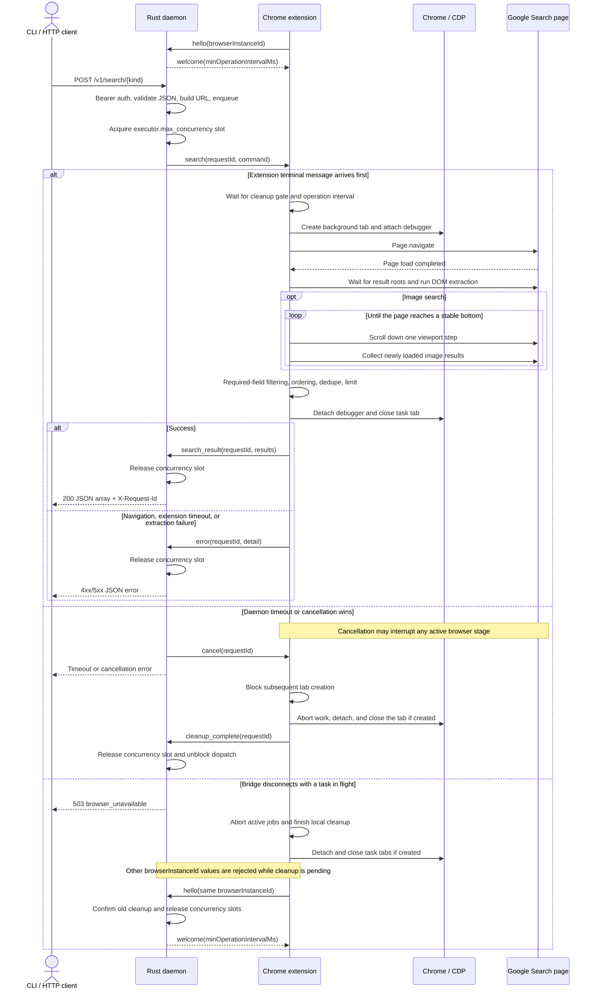
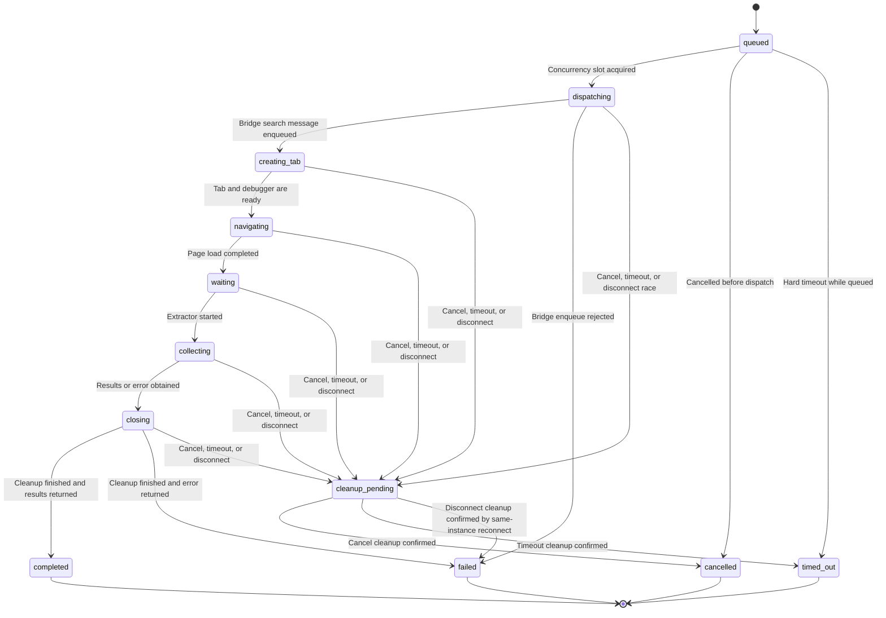

English | [简体中文](README_ZH.md)

# Browser Search

Browser Search turns the Chrome or Chromium browser already running on the local machine into a structured Google Search service. Callers can use the standalone `search` CLI or call the Rust daemon HTTP API directly. The daemon sends jobs to the Chrome extension over WebSocket; the extension creates a background tab, navigates and reads the live DOM through CDP, closes the tab when finished, and returns JSON results.

## Features

- **Real-browser search**
  - Uses the existing Chrome profile, cookies, login state, and network environment without Playwright, Selenium, or another browser automation runtime.
  - The extension uses `chrome.debugger` only for the search workflows defined by this project; it does not expose an arbitrary CDP proxy.
- **Five Google Search endpoints**
  - Web, news, image, video, and forum search each have a dedicated API endpoint and CLI subcommand.
  - Result fields, vertical-search parameters, and DOM selectors are TOML-configurable; common fields are serialized in the order defined for each endpoint.
- **CLI pagination and merging**
  - Non-image searches use a fixed page size of 10 and accept any requested result count from `1..100`.
  - The CLI submits requests according to the daemon-wide search-job concurrency limit, merges pages in page order, deduplicates across pages, and truncates to the requested count.
  - Image search sends one request; the extension scrolls the current result page and continuously collects lazy-loaded results.
- **Bounded job scheduling**
  - The daemon limits concurrent search jobs and queued jobs.
  - A configurable gate in the extension staggers the actual `chrome.tabs.create` operations and restarts the cooldown whenever a task page is confirmed closed, independently of the concurrency limit.
  - Timeouts, extension disconnects, navigation failures, and extraction failures produce consistent error responses and trigger tab and debugger cleanup.
- **Local-first defaults**
  - The HTTP API and extension bridge listen only on `127.0.0.1` by default.
  - The API Token and Extension Token are independent; browser credentials remain in the Chrome profile.
- **Lightweight runtime**
  - The daemon and CLI are standalone Rust executables.
  - Node.js is required only during development for extension builds and license-inventory verification; the daemon and CLI do not require Node.js at runtime.

## Downloads

Rolling builds are published in the GitHub `Latest` Release. Every archive has a matching SHA-256 sidecar, and the Release also publishes an aggregate [SHA256SUMS](https://github.com/Joey-Kot/Browser-Search/releases/download/Latest/SHA256SUMS) file.

### Browser Extension

| Component | Download | SHA-256 |
|---|---|---|
| Chrome/Chromium extension | [Browser Extension](https://github.com/Joey-Kot/Browser-Search/releases/download/Latest/browser-search-extension.zip) | [sha256](https://github.com/Joey-Kot/Browser-Search/releases/download/Latest/browser-search-extension.zip.sha256) |

### Server

| Platform | Download | SHA-256 |
|---|---|---|
| Linux x86_64 | [linux-x86_64](https://github.com/Joey-Kot/Browser-Search/releases/download/Latest/browser-search-server-linux-x86_64.tar.gz) | [sha256](https://github.com/Joey-Kot/Browser-Search/releases/download/Latest/browser-search-server-linux-x86_64.tar.gz.sha256) |
| Linux arm64 | [linux-arm64](https://github.com/Joey-Kot/Browser-Search/releases/download/Latest/browser-search-server-linux-arm64.tar.gz) | [sha256](https://github.com/Joey-Kot/Browser-Search/releases/download/Latest/browser-search-server-linux-arm64.tar.gz.sha256) |
| Windows x86_64 | [windows-x86_64](https://github.com/Joey-Kot/Browser-Search/releases/download/Latest/browser-search-server-windows-x86_64.zip) | [sha256](https://github.com/Joey-Kot/Browser-Search/releases/download/Latest/browser-search-server-windows-x86_64.zip.sha256) |
| Windows arm64 | [windows-arm64](https://github.com/Joey-Kot/Browser-Search/releases/download/Latest/browser-search-server-windows-arm64.zip) | [sha256](https://github.com/Joey-Kot/Browser-Search/releases/download/Latest/browser-search-server-windows-arm64.zip.sha256) |
| macOS x86_64 | [macos-x86_64](https://github.com/Joey-Kot/Browser-Search/releases/download/Latest/browser-search-server-macos-x86_64.zip) | [sha256](https://github.com/Joey-Kot/Browser-Search/releases/download/Latest/browser-search-server-macos-x86_64.zip.sha256) |
| macOS arm64 | [macos-arm64](https://github.com/Joey-Kot/Browser-Search/releases/download/Latest/browser-search-server-macos-arm64.zip) | [sha256](https://github.com/Joey-Kot/Browser-Search/releases/download/Latest/browser-search-server-macos-arm64.zip.sha256) |

### CLI

| Platform | Download | SHA-256 |
|---|---|---|
| Linux x86_64 | [linux-x86_64](https://github.com/Joey-Kot/Browser-Search/releases/download/Latest/browser-search-cli-linux-x86_64.tar.gz) | [sha256](https://github.com/Joey-Kot/Browser-Search/releases/download/Latest/browser-search-cli-linux-x86_64.tar.gz.sha256) |
| Linux arm64 | [linux-arm64](https://github.com/Joey-Kot/Browser-Search/releases/download/Latest/browser-search-cli-linux-arm64.tar.gz) | [sha256](https://github.com/Joey-Kot/Browser-Search/releases/download/Latest/browser-search-cli-linux-arm64.tar.gz.sha256) |
| Windows x86_64 | [windows-x86_64](https://github.com/Joey-Kot/Browser-Search/releases/download/Latest/browser-search-cli-windows-x86_64.zip) | [sha256](https://github.com/Joey-Kot/Browser-Search/releases/download/Latest/browser-search-cli-windows-x86_64.zip.sha256) |
| Windows arm64 | [windows-arm64](https://github.com/Joey-Kot/Browser-Search/releases/download/Latest/browser-search-cli-windows-arm64.zip) | [sha256](https://github.com/Joey-Kot/Browser-Search/releases/download/Latest/browser-search-cli-windows-arm64.zip.sha256) |
| macOS x86_64 | [macos-x86_64](https://github.com/Joey-Kot/Browser-Search/releases/download/Latest/browser-search-cli-macos-x86_64.zip) | [sha256](https://github.com/Joey-Kot/Browser-Search/releases/download/Latest/browser-search-cli-macos-x86_64.zip.sha256) |
| macOS arm64 | [macos-arm64](https://github.com/Joey-Kot/Browser-Search/releases/download/Latest/browser-search-cli-macos-arm64.zip) | [sha256](https://github.com/Joey-Kot/Browser-Search/releases/download/Latest/browser-search-cli-macos-arm64.zip.sha256) |

## Architecture

```mermaid
flowchart LR
    Client["search CLI or HTTP client"] -->|"Bearer API Token"| API["Rust daemon<br/>HTTP API :17330"]
    API --> Queue["Bounded job queue"]
    Queue --> Scheduler["Global search-job concurrency scheduler"]
    Scheduler <-->|"WebSocket :17331<br/>search / cancel / result / cleanup"| Extension["Chrome extension"]
    Extension --> Gate["Global tab-opening gate<br/>min_operation_interval"]
    Gate -->|"chrome.tabs.create"| Chrome["Current Chrome profile"]
    Extension -->|"chrome.debugger + tab cleanup"| Chrome
    Chrome --> Google["Google Search result page"]
    Google -->|"Live DOM"| Extractor["Config-driven extractor"]
    Extractor -->|"JSON results or error"| Extension
    Scheduler -->|"Task outcome"| API
    API --> Client
```



HTTP callers connect only to the daemon. The extension bridge accepts one extension instance at a time. To lock the service to a specific Chrome profile, configure `bridge.browser_instance_id`.

## Request Sequence



The HTTP search API is synchronous and does not expose task polling. For normal completion or an extension-reported error, the request waits for queueing, page loading, extraction, and cleanup to finish. When `timeoutMs` expires, the daemon returns a timeout error but keeps the task's scheduler slot and sends a cancellation command. The extension immediately blocks subsequent tab creation, closes the tab and debugger session, then sends `cleanup_complete`; only then does the daemon release the slot, while the extension starts the operation interval from the completed cleanup.

## Search Job States

The extension sends internal progress stages. Externally, the daemon exposes only active-job and queued-job counts through `/v1/status`.



Entering `cleanup_pending` already completes the HTTP request with its terminal error, but the concurrency slot remains occupied until cleanup is confirmed. The extension stores active-job tab IDs in `chrome.storage.session`. When the extension Service Worker starts again, it closes tabs recorded as leftovers. Normal completion, cancellation, timeout, and bridge disconnection also detach the debugger and close the task tab.

## Current Capabilities and Limitations

- Google is currently the only search engine. The default vertical parameters are:

  | Type | API/CLI name | Google parameter |
  |---|---|---|
  | Web | `web` | `udm=14` |
  | News | `news` | `tbm=nws` |
  | Images | `images` | `udm=2` |
  | Videos | `videos` | `udm=7` |
  | Forums | `forums` | `udm=18` |

- The daemon accepts one Chrome extension connection, but it can run multiple search jobs according to `executor.max_concurrency`.
- Non-image endpoints extract only the result page selected by `start` and never click a next-page control. The CLI aggregates pages through multiple HTTP requests.
- The image endpoint does not paginate with `start`. The extension scrolls the current image-results page to trigger lazy loading, but it does not click "Show more," open previews, or enter image detail pages.
- The default image `imgurl` is the snapshot or thumbnail URL already loaded on the Google result page; it is not guaranteed to be the original image from the source site. Base64 `data:` images are discarded.
- The project does not solve Google verification or consent pages. If one is detected, extraction fails.
- Google can change its DOM structure. If the default rules stop matching, update the TOML selectors and restart the daemon; the extension does not need to be rebuilt.
- The search API has no external cancellation endpoint and does not persist result history. Successful results are returned directly to the active HTTP request.
- The daemon does not provide TLS. For access across hosts, use a trusted reverse proxy, TLS, and network access controls.

## Requirements

Runtime:

- Chrome or Chromium 125 or later.
- A `search-server` build matching the operating system and CPU architecture.
- The built extension ZIP, or `extension/dist/` produced from source.
- The `search` CLI is optional; callers can use the HTTP API directly.
- The host running Chrome must be able to reach Google Search.

Development:

- Rust 1.97.1.
- Node.js 24; GitHub Actions currently uses Node.js 24.18.1.

Node.js is used only for extension type checking, tests, builds, and third-party license-inventory verification. The daemon and CLI do not require Node.js at runtime.

The current bridge protocol version is `1`. Update the daemon and extension together; mismatched protocol versions are rejected explicitly.

## Build from Source

Test the Rust workspace, then build the daemon and CLI:

```bash
cargo test --workspace --locked
cargo clippy --workspace --all-targets --locked -- -D warnings
cargo build --release --locked --bin search-server --bin search
```

Build outputs:

| Component | Linux/macOS | Windows |
|---|---|---|
| Server | `target/release/search-server` | `target/release/search-server.exe` |
| CLI | `target/release/search` | `target/release/search.exe` |

Install dependencies, check, test, and build the extension:

```bash
npm --prefix extension ci --no-audit --no-fund
npm --prefix extension run typecheck
npm --prefix extension test
npm --prefix extension run build
```

In Chrome developer mode, load the generated `extension/dist/` directory. Its top level contains `manifest.json` directly.

Verify the third-party license inventory:

```bash
node scripts/generate-third-party-licenses.mjs --check
```

## Quick Setup

### 1. Configure and Start the Daemon

Copy the complete configuration example and replace both Tokens:

```bash
cp config.example.toml config.toml
```

Linux and macOS:

```bash
./search-server --config ./config.toml
```

PowerShell:

```powershell
.\search-server.exe --config .\config.toml
```

### 2. Load and Configure the Extension

1. Extract `browser-search-extension.zip`, or build the extension from source.
2. Open `chrome://extensions`.
3. Enable **Developer mode**.
4. Click **Load unpacked**.
5. Select the extracted extension directory or `extension/dist/`.
6. Open the Browser Search toolbar popup.
7. Set **Bridge URL** to `ws://127.0.0.1:17331/bridge`.
8. Set **Extension Token** to the configured `bridge.extension_token`.
9. Click **Save and reconnect**, then wait for the state to become **Connected**.

### 3. Verify the Connection and Search

```bash
curl -sS http://127.0.0.1:17330/v1/status \
  -H 'Authorization: Bearer YOUR_API_TOKEN'
```

Using the CLI:

```bash
export SEARCH_API_KEY="YOUR_API_TOKEN"
./search web --query "Tokyo" --search-num 10
```

Or call the API directly:

```bash
curl -sS -X POST http://127.0.0.1:17330/v1/search/web \
  -H 'Authorization: Bearer YOUR_API_TOKEN' \
  -H 'Content-Type: application/json' \
  -d '{"query":"Tokyo","limit":10}'
```

## Command-Line Client

`search` is a standalone client for the daemon. It provides `web`, `news`, `images`, `videos`, and `forums` subcommands and writes a compact JSON array to standard output on success.

### CLI Environment Variables

The CLI reads the service URL and API Token only from environment variables; it does not provide equivalent command-line options.

| Environment variable | Required | Purpose |
|---|---|---|
| `SEARCH_BASE_URL` | No | Daemon API base URL (HTTP or HTTPS). Default: `http://127.0.0.1:17330`. |
| `SEARCH_API_KEY` | Yes | Sent as `Authorization: Bearer <key>` and must equal the daemon `server.api_token`. |

Linux and macOS:

```bash
export SEARCH_BASE_URL="http://127.0.0.1:17330"
export SEARCH_API_KEY="YOUR_API_TOKEN"
```

PowerShell:

```powershell
$env:SEARCH_BASE_URL = "http://127.0.0.1:17330"
$env:SEARCH_API_KEY = "YOUR_API_TOKEN"
```

Windows Command Prompt:

```batch
set "SEARCH_BASE_URL=http://127.0.0.1:17330"
set "SEARCH_API_KEY=YOUR_API_TOKEN"
```

### Basic CLI Requests

```bash
search web --query "Tokyo" --search-num 100
search news --query "OpenAI" --search-num 20
search images --query "Tokyo skyline" --search-num 50
search videos --query "Tokyo travel" --search-num 30
search forums --query "Tokyo travel forum" --search-num 20
```

View root-command and subcommand help:

```bash
search --help
search web --help
```

### CLI Options

All five subcommands use the same options:

| Option | Required/default | Purpose |
|---|---|---|
| `--query <TEXT>` | Required | Search terms. Leading and trailing whitespace is removed; the remaining value must be non-empty and at most 512 characters. |
| `--search-num <COUNT>` | `10` | Target result count from `1..100`. The actual count can be lower because of available page results, required-field filtering, or deduplication. |
| `--timeout <SECONDS>` | `120` | Timeout for each CLI-to-daemon HTTP request. When `--search-timeout` is set, this value must be at least two seconds greater. |
| `--search-timeout <SECONDS>` | Daemon default | Server-side timeout for each search page. The CLI converts seconds to request `timeoutMs`. |
| `--help` | — | Show usage and options for the current command. |

### Pagination, Concurrency, and Merging

Non-image endpoints use a fixed page size of 10. The CLI rounds `--search-num` up to a whole number of pages:

| Requested count | HTTP requests |
|---:|---|
| `1..10` | `start=0, limit=10` |
| `25` | `start=0,10,20`, for 3 pages |
| `100` | `start=0,10,...,90`, for 10 pages |

The CLI first calls `/v1/status` and uses `maxConcurrency` as the maximum page-request concurrency for the current command. The daemon uses the same global `executor.max_concurrency` semaphore to bound unfinished search jobs submitted by this CLI, other CLI processes, and direct API callers. The daemon sends `executor.min_operation_interval` to the extension in the Bridge welcome message; the extension applies it at the actual `chrome.tabs.create` boundary and restarts the interval from the most recently completed page cleanup. On timeout or cancellation, the task keeps its daemon slot until the extension reports cleanup completion. After a Bridge disconnect, the extension finishes cleaning all active jobs before reconnecting; while cleanup is pending, only that same `browser_instance_id` may reconnect and confirm it.

Pages can complete out of order, but the CLI merges them in `start` order, performs stable deduplication by `url`, and truncates the merged array to `--search-num`. If any page fails, the CLI stops submitting pages that have not started, waits for already-issued HTTP requests to finish, and then returns the error.

Image search is not paginated. The CLI sends one image API request, the daemon extracts the current page using the fixed image-profile limit, and the CLI deduplicates and truncates the returned results to `--search-num`.

### CLI Output and Exit Behavior

Successful output is the same JSON array returned by the corresponding HTTP endpoint:

```json
[
  {
    "title": "Tokyo",
    "description": "Information about Tokyo.",
    "url": "https://example.com/tokyo"
  }
]
```

Errors are written to standard error.

| Exit code | Meaning |
|---:|---|
| `0` | Search completed and JSON was written. |
| `1` | Network, authentication, daemon, navigation, or extraction failure. |
| `2` | Invalid arguments or missing CLI environment configuration. |

## Configure the Daemon

The daemon does not search for `config.toml` automatically. When `--config` is provided, it reads that file. When omitted, it uses the embedded defaults and generates process-local random values for either Token that remains empty.

Start from the complete example:

```bash
cp config.example.toml config.toml
search-server --config config.toml
```

Core service configuration:

```toml
[server]
listen = "127.0.0.1:17330"
api_token = "replace-with-api-token"
allow_cors = false

[bridge]
listen = "127.0.0.1:17331"
extension_token = "replace-with-extension-token"
browser_instance_id = ""
ping_interval_seconds = 20

[executor]
max_concurrency = 1
min_operation_interval = 4000
max_queue_size = 64
max_timeout_ms = 120000
load_timeout_ms = 20000
selector_timeout_ms = 10000
```

`server.api_token` and `bridge.extension_token` should use different values. If either Token is empty, the daemon generates a random 48-character temporary Token and writes it to the log. Temporary Tokens change on the next start.

See [config.example.toml](https://github.com/Joey-Kot/Browser-Search/blob/main/config.example.toml) for the complete search parameters and selectors. Embedded rules come from [search-rules.default.toml](https://github.com/Joey-Kot/Browser-Search/blob/main/search-rules.default.toml).

### Daemon Configuration Options

| Setting | Default | Purpose |
|---|---:|---|
| `server.listen` | `127.0.0.1:17330` | HTTP API listen address. |
| `server.api_token` | Empty | Bearer Token for `/v1/*` endpoints. A temporary Token is generated when empty. |
| `server.allow_cors` | `false` | Allow any origin to access the API with GET, POST, Authorization, and Content-Type. Authentication remains enforced. |
| `bridge.listen` | `127.0.0.1:17331` | Extension WebSocket bridge listen address. Extension configuration must append `/bridge`. |
| `bridge.extension_token` | Empty | Token carried by the first extension `hello` message. It should differ from the API Token. |
| `bridge.browser_instance_id` | Empty | Optional Chrome-profile lock. When empty, any one extension instance can connect. |
| `bridge.ping_interval_seconds` | `20` | Bridge heartbeat interval, clamped to `5..300` seconds. |
| `executor.max_concurrency` | `1` | Maximum number of search jobs dispatched and not yet finished by the daemon, with a minimum of 1. |
| `executor.min_operation_interval` | `4000` | Global minimum interval between actual extension tab openings, in milliseconds; completing task-page cleanup restarts the interval. `0` disables it. Timeout and cancellation keep the task slot occupied until the extension confirms cleanup; after a disconnect, only the original browser instance may reconnect and confirm cleanup. |
| `executor.max_queue_size` | `64` | Maximum queued-job capacity, with a minimum of 1. A full queue returns `queue_full`. |
| `executor.max_timeout_ms` | `120000` | Maximum allowed request `timeoutMs`, with a minimum of 1000ms. |
| `executor.load_timeout_ms` | `20000` | Page-navigation timeout. It is capped by the remaining request time and has a minimum of 1000ms. |
| `executor.selector_timeout_ms` | `10000` | Base time for waiting on result selectors, extraction, and image scrolling. It is capped by the remaining request time and has a minimum of 250ms. |
| `search.common.base_url` | `https://www.google.com/search` | Base URL shared by all search profiles. Only HTTP and HTTPS are accepted. |
| `search.common.query_parameter` | `q` | Query-string parameter name for the search terms. |
| `search.common.start_parameter` | `start` | Start-offset parameter for non-image endpoints. An empty string disables it. |
| `search.common.limit_parameter` | `num` | Search-count parameter name. An empty string disables it. |
| `search.<kind>.limit` | Unset | Optional fixed profile count that overrides the request `limit`. The default image profile sets this to `100`. Leave non-image profile limits unset when using CLI pagination. |

Configuration files are merged recursively over the embedded defaults. Specify only the values that need to change:

```toml
[executor]
max_concurrency = 4

[search.common.params]
hl = "ja"
gl = "jp"
```

### Command-Line and Environment Overrides

```text
Usage: search-server [OPTIONS]

Options:
      --config <CONFIG>
      --listen <LISTEN>
      --bridge-listen <BRIDGE_LISTEN>
      --api-token <API_TOKEN>
      --extension-token <EXTENSION_TOKEN>
      --max-concurrency <MAX_CONCURRENCY>
```

Tokens can also be supplied through environment variables:

```bash
SEARCH_API_KEY="api-token" \
BROWSER_SEARCH_EXTENSION_TOKEN="extension-token" \
search-server --config config.toml
```

Configuration precedence is: embedded defaults, configuration file, corresponding environment variable, then command-line option. A command-line value takes precedence over its environment variable.

## Configure the Chrome Extension

The selected extension directory must contain `manifest.json` directly at its top level.

1. Open `chrome://extensions`.
2. Enable **Developer mode**.
3. Click **Load unpacked**.
4. Select `extension/dist/` or the directory extracted from `browser-search-extension.zip`.
5. Open the Browser Search toolbar popup.
6. Set **Bridge URL** to `ws://127.0.0.1:17331/bridge` or `ws://<address>/bridge` for the configured `bridge.listen` address. Use `wss://` when connecting through a TLS reverse proxy.
7. Set **Extension Token** to `bridge.extension_token`, not the API Token.
8. Click **Save and reconnect**. The extension saves the settings and reloads; the final state should be **Connected**.

The popup displays:

- Current bridge connection state.
- The automatically generated and persisted browser instance ID.
- Current extension version.

To lock the daemon to the current Chrome profile, copy the popup instance ID into `bridge.browser_instance_id` and restart the daemon. When the setting is empty, the daemon accepts the first extension instance that connects, but still permits only one active instance.

If another extension is already connected, or `bridge.browser_instance_id` does not match the current instance, the Bridge returns `instance_conflict` during the WebSocket `hello` phase and rejects the connection. The popup ultimately remains disconnected. This is a bridge-handshake error, not an HTTP search endpoint `503` response.

## HTTP API

Every `/v1/*` endpoint requires:

```http
Authorization: Bearer YOUR_API_TOKEN
```

`GET /health` is a public liveness endpoint.

| Method and path | Purpose |
|---|---|
| `GET /health` | Return process liveness and version. |
| `GET /v1/status` | Return extension connection metadata, active jobs, queued jobs, and the concurrency limit. |
| `POST /v1/search/web` | Web search. |
| `POST /v1/search/news` | News search. |
| `POST /v1/search/images` | Image search. |
| `POST /v1/search/videos` | Video search. |
| `POST /v1/search/forums` | Forum search. |

Unknown JSON fields return HTTP 400.

### Health and Status

```bash
curl -sS http://127.0.0.1:17330/health
```

```json
{
  "status": "ok",
  "version": "0.1.0"
}
```

```bash
curl -sS http://127.0.0.1:17330/v1/status \
  -H 'Authorization: Bearer YOUR_API_TOKEN'
```

```json
{
  "extensionConnected": true,
  "browserInstanceId": "chrome-profile-00000000-0000-0000-0000-000000000000",
  "extensionVersion": "0.1.0",
  "activeJobs": 0,
  "queuedJobs": 0,
  "maxConcurrency": 1
}
```

When the extension is disconnected, `browserInstanceId` and `extensionVersion` are `null`.

### Common Request Fields

All search endpoints use the same JSON shape:

```json
{
  "query": "Tokyo",
  "start": 0,
  "limit": 10,
  "timeoutMs": 30000
}
```

| Field | Required/default | Purpose |
|---|---|---|
| `query` | Required | Search terms. Leading and trailing whitespace is removed; the remaining value must be non-empty and at most 512 characters. |
| `start` | `0` | Result offset from `0..1000`. The image endpoint ignores this field after validation. |
| `limit` | `10` | Requested result count from `1..100`. A fixed profile `limit` can override it; the default image profile fixes it at `100`. |
| `timeoutMs` | `min(30000, executor.max_timeout_ms)` | Hard job timeout measured from enqueue, covering queueing, loading, and extraction. Cleanup is triggered after timeout. Valid range: 1000ms through `executor.max_timeout_ms`. |

A successful response is a JSON array. The `X-Request-Id` response header contains the internal search-job UUID.

Result object fields are defined by the selected profile `fields` configuration. Default fields are serialized in a fixed order, followed by custom fields.

### Web Search

```bash
curl -sS -X POST http://127.0.0.1:17330/v1/search/web \
  -H 'Authorization: Bearer YOUR_API_TOKEN' \
  -H 'Content-Type: application/json' \
  -d '{"query":"Tokyo","start":0,"limit":10}'
```

```json
[
  {
    "title": "Tokyo",
    "description": "Information about Tokyo.",
    "url": "https://example.com/tokyo"
  }
]
```

Default field order: `title`, `description`, `url`.

### News Search

```bash
curl -sS -X POST http://127.0.0.1:17330/v1/search/news \
  -H 'Authorization: Bearer YOUR_API_TOKEN' \
  -H 'Content-Type: application/json' \
  -d '{"query":"Tokyo","limit":10}'
```

```json
[
  {
    "title": "Tokyo headline",
    "description": "News description.",
    "url": "https://example.com/news/tokyo",
    "source": "Example News",
    "time": "2 hours ago"
  }
]
```

Default field order: `title`, `description`, `url`, `source`, `time`.

### Image Search

```bash
curl -sS -X POST http://127.0.0.1:17330/v1/search/images \
  -H 'Authorization: Bearer YOUR_API_TOKEN' \
  -H 'Content-Type: application/json' \
  -d '{"query":"Tokyo skyline"}'
```

```json
[
  {
    "title": "Tokyo skyline",
    "imgurl": "https://encrypted-tbn0.gstatic.com/images?q=tbn:example",
    "url": "https://example.com/tokyo-guide"
  }
]
```

Default field order: `title`, `imgurl`, `url`.

- `title` comes from the image element `alt` attribute.
- `imgurl` comes from the image `src/currentSrc` already loaded on the Google result page and is converted to an absolute HTTP(S) URL.
- `url` comes from the result root `data-lpage` attribute and identifies the source page.
- `data:image/...;base64,...` is not HTTP(S), so the complete result is discarded.

Image-request `start` and `limit` values must still pass the common range checks, but they do not change the default image-search behavior. The default image profile sends `num=100` and applies a final limit of 100. The extension scrolls progressively, continuously extracts results, and preserves first-seen DOM order until it reaches a stable page bottom or the selector/request timeout.

### Video Search

```bash
curl -sS -X POST http://127.0.0.1:17330/v1/search/videos \
  -H 'Authorization: Bearer YOUR_API_TOKEN' \
  -H 'Content-Type: application/json' \
  -d '{"query":"Tokyo travel","limit":10}'
```

```json
[
  {
    "title": "Tokyo Travel Guide",
    "description": "A walking tour through Tokyo.",
    "url": "https://www.youtube.com/watch?v=example",
    "duration": "12:34"
  }
]
```

Default field order: `title`, `description`, `url`, `duration`. The default rules require `title`, `url`, and `duration`.

### Forum Search

```bash
curl -sS -X POST http://127.0.0.1:17330/v1/search/forums \
  -H 'Authorization: Bearer YOUR_API_TOKEN' \
  -H 'Content-Type: application/json' \
  -d '{"query":"Tokyo travel forum","limit":10}'
```

```json
[
  {
    "title": "Tokyo travel recommendations",
    "description": "Community recommendations for visiting Tokyo.",
    "url": "https://example.com/forums/tokyo-travel"
  }
]
```

Default field order: `title`, `description`, `url`.

### Error Responses

```json
{
  "error": {
    "code": "extraction_failed",
    "message": "Configured roots matched 10 elements, but no result passed required fields: title=10",
    "retryable": false
  }
}
```

| HTTP status | Error code | Typical cause |
|---:|---|---|
| `400` | `invalid_request`, `protocol_error` | Invalid JSON, search kind, field range, or bridge protocol data. |
| `401` | `unauthorized` | Missing or incorrect API Token. |
| `422` | `navigation_failed`, `extraction_failed` | Page navigation failed, Google returned a verification page, selectors stopped matching, or required fields could not be extracted. |
| `429` | `queue_full` | The daemon job queue is full. |
| `503` | `browser_unavailable` | The extension is not connected or the active connection was lost. |
| `504` | `timeout` | Queueing, navigation, selector waiting, or extraction reached the hard timeout. |
| `500` | `internal_error` | Internal daemon failure. |

## Search Rules

The daemon loads TOML search rules into memory at startup and sends the selected rules to the extension with every job. After changing rules, restart the daemon; rebuilding or reloading the extension is unnecessary.

Default rules are available in [search-rules.default.toml](https://github.com/Joey-Kot/Browser-Search/blob/main/search-rules.default.toml). The complete editable example is [config.example.toml](https://github.com/Joey-Kot/Browser-Search/blob/main/config.example.toml).

### Profile Structure

The default web profile:

```toml
[search.web]
root_selectors = ["[data-snc]"]
dedupe_field = "url"

[search.web.params]
udm = "14"

[search.web.fields.title]
selectors = ["[data-snhf] h3"]
required = true

[search.web.fields.description]
selectors = ["[data-sncf]"]
max_length = 1000

[search.web.fields.url]
selectors = ["[data-snhf] a"]
attribute = "href"
transform = "google_url"
required = true
```

| Setting | Purpose |
|---|---|
| `root_selectors` | Query result-root elements across the entire document. Selectors run in configuration order; each selector preserves DOM order, and matching elements are merged and deduplicated before processing. |
| `params` | Google URL parameters for the current profile. Keys override matching `search.common.params` entries. |
| `limit` | Optional fixed request count and final output limit. When set, it overrides the request `limit`. |
| `dedupe_field` | Field used for within-page deduplication. When absent from a result, the full result object is used instead. |
| `fields.<name>` | Define an output field; `<name>` becomes the JSON key. |
| `enabled` | Defaults to `true`. When `false`, the field is not sent to the extension or included in output. |
| `selectors` | Complete CSS selector candidates evaluated relative to the current result root. The first matching element is used. |
| `attribute` | Read `text`, `href`, `src`, or any HTML attribute. When omitted, text is read. |
| `transform` | Value transform applied after reading: `none`, `absolute_url`, or `google_url`. |
| `required` | When `true`, discard the entire result if this field is empty. |
| `max_length` | Optional maximum output length. It must be greater than 0. |

### Selector Semantics

Every `root_selectors` entry queries the complete document. Results are unioned and deduplicated by element identity. Overall ordering follows selector configuration order and is not re-sorted into global DOM order.

Field `selectors` are a **fallback list**, not a step-by-step path. For example:

```toml
selectors = [".primary-title", ".fallback-title"]
```

This first queries `.primary-title` and then `.fallback-title` if the first selector does not match. It does not mean:

```text
.primary-title > .fallback-title
```

To traverse multiple levels, put the complete CSS path in one string:

```toml
selectors = ["[data-curl] > div > div:nth-child(3) > span"]
```

Field selectors are always scoped to the current result root. To read the root itself, use:

```toml
selectors = ["&"]
```

or:

```toml
selectors = [":scope"]
```

An invalid CSS selector makes the current search return `extraction_failed`; the error identifies the field and selector.

### Attributes and Transforms

| Value | Behavior |
|---|---|
| `attribute` omitted or `text` | Read `textContent` after collapsing consecutive whitespace. |
| `attribute = "href"` | Prefer the absolute link-object `href`, then fall back to the raw attribute. |
| `attribute = "src"` | Prefer image `currentSrc`, then `src` and the raw attribute. |
| Any other `attribute` | Read the named HTML attribute and normalize whitespace. |
| `transform = "none"` | Do not transform the value. |
| `transform = "absolute_url"` | Resolve relative URLs against the current page and retain only HTTP(S). Protocols such as `data:` and `javascript:` become empty values. |
| `transform = "google_url"` | Unwrap `q`/`url` from Google `/url` redirects and source addresses from `/imgres` links. |

### Default Fields

| Type | Default field order | Required default fields |
|---|---|---|
| `web` | `title`, `description`, `url` | `title`, `url` |
| `news` | `title`, `description`, `url`, `source`, `time` | `title`, `url` |
| `images` | `title`, `imgurl`, `url` | All |
| `videos` | `title`, `description`, `url`, `duration` | `title`, `url`, `duration` |
| `forums` | `title`, `description`, `url` | `title`, `url` |

Custom string fields can be added, and default fields can be disabled:

```toml
[search.news.fields.time]
enabled = false
```

Because configuration is merged recursively, changing one selector does not require copying the entire profile:

```toml
[search.news.fields.title]
selectors = [".new-primary-title", ".fallback-title"]
```

### Extraction Diagnostics

If result roots matched but every candidate was rejected by required fields, the error reports the root count and failed-field counts:

```text
Configured roots matched 10 elements, but no result passed required fields: title=10
```

If the page body explicitly reports that there are no results, the endpoint returns an empty array. If no configured root matches at all, it returns `extraction_failed`. Google verification and consent pages are also detected as errors.

## Security Defaults

- The HTTP API binds to `127.0.0.1:17330` and the extension bridge binds to `127.0.0.1:17331` by default.
- The API Token and Extension Token use different channels and configuration fields.
- Tokens are not placed in the Bridge URL. The extension sends the Extension Token in its first WebSocket `hello` message.
- `server.allow_cors` defaults to `false`. Even when CORS is enabled, Bearer authentication remains mandatory for `/v1/*`.
- The daemon accepts one extension connection and can lock it to a Chrome profile with `browser_instance_id`.
- Login cookies, account credentials, and Google session state remain in the Chrome profile and are not returned to the daemon or API caller.
- The extension accepts only the defined `search` and `cancel` jobs; it does not expose a general remote-debugging interface.
- The daemon does not provide TLS. If either listen address is moved off loopback, use a reverse proxy for TLS and add firewall or other network isolation.

## Troubleshooting

| Symptom | Check |
|---|---|
| `401 unauthorized` | Verify that the CLI/API Token equals `server.api_token`. |
| `503 browser_unavailable` | Verify that the extension shows **Connected** and that the Bridge URL and `bridge.extension_token` are correct. |
| The extension remains disconnected and the Bridge returns `instance_conflict` | Check whether another extension is connected and whether `bridge.browser_instance_id` matches the popup instance ID. This error occurs during the WebSocket handshake. |
| `429 queue_full` | Reduce caller concurrency or increase `executor.max_queue_size`. |
| `504 timeout` | Increase request `timeoutMs` and `executor.max_timeout_ms`, then check network access, Google page loading, and selector waits. |
| `422 navigation_failed` | Check Google reachability, proxy configuration, and DNS. |
| `422 extraction_failed` | Check for verification/consent pages, Google DOM changes, `root_selectors`, and required-field selectors. |
| Image results are unexpectedly sparse | Increase `executor.selector_timeout_ms`, verify that the page can continue scrolling, and check the image root and `imgurl` selectors. |
| The CLI exits after the first page fails | The CLI waits for already-issued HTTP requests to finish and does not submit remaining pages. Daemon or extension cleanup can continue after a timeout response. |

## Repository Layout

| Component | Source path | Build output or purpose |
|---|---|---|
| Rust daemon | `crates/browser-search-daemon/src/` | `target/release/search-server` |
| Rust CLI | `crates/browser-search-cli/src/` | `target/release/search` |
| Chrome extension | `extension/src/` | `extension/dist/` |
| Extension tests | `extension/tests/` | CDP, task-cleanup, and Google-extractor tests |
| HTTP API definition | `spec/openapi.yaml` | OpenAPI 3.1 definition |
| Embedded search rules | `search-rules.default.toml` | Default profiles compiled into the daemon |
| Complete configuration example | `config.example.toml` | Daemon, bridge, executor, and search-rule example |
| Release workflow | `.github/workflows/latest-release.yml` | Builds the extension plus six daemon and six CLI platform/architecture targets |
| License generator | `scripts/generate-third-party-licenses.mjs` | Verifies the locked Rust dependency license inventory |

## License

Browser Search is licensed under GPL-3.0-or-later. See [LICENSE](LICENSE) for the complete text.

Third-party Rust runtime dependencies and their licenses are listed in [THIRD_PARTY_LICENSES.md](THIRD_PARTY_LICENSES.md) and [THIRD_PARTY_LICENSES/](THIRD_PARTY_LICENSES/). Extension npm packages are development-only build tools and are not included in `extension/dist/`.
