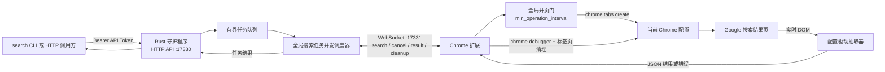
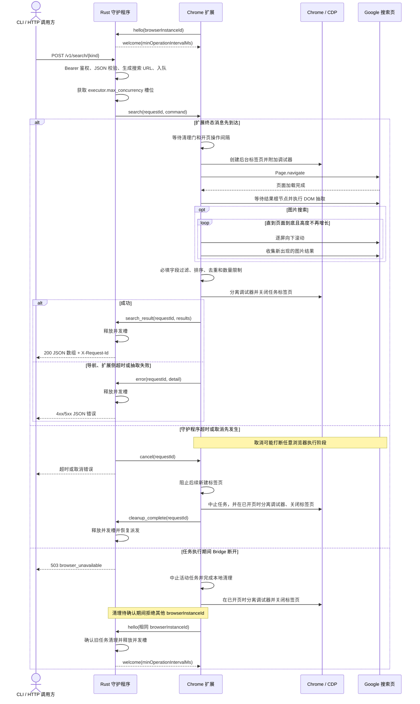
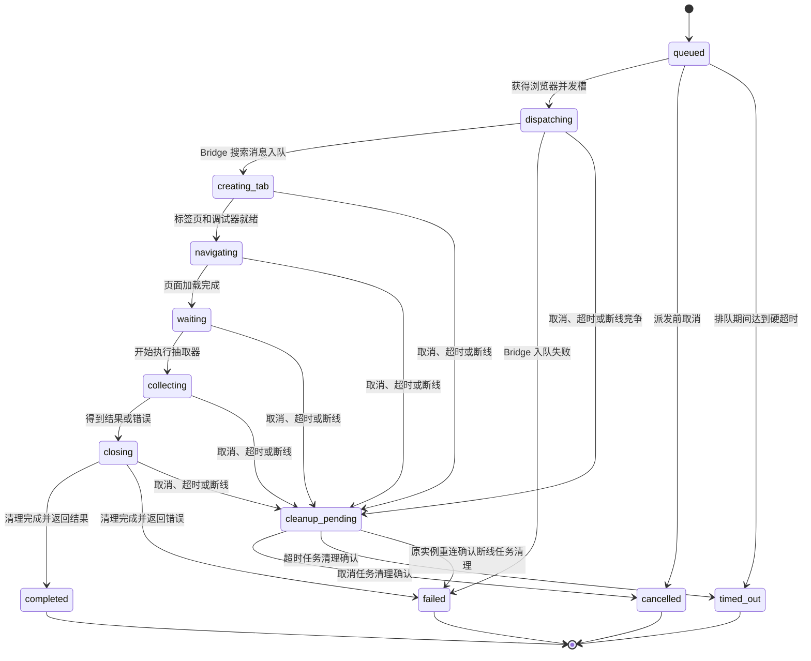

[English](README.md) | 简体中文

# Browser Search

Browser Search 把本机正在使用的 Chrome 或 Chromium 变成一个结构化 Google 搜索服务。调用方可以使用独立的 `search` CLI，也可以直接请求 Rust 守护程序的 HTTP API；守护程序通过 WebSocket 把任务交给 Chrome 扩展，扩展创建后台标签页、使用 CDP 导航和读取实时 DOM，完成后关闭标签页并返回 JSON 结果。

## 特性

- **真实浏览器搜索**
  - 使用现有 Chrome 配置、Cookie、登录状态和网络环境，不依赖 Playwright、Selenium 等浏览器自动化运行时。
  - 扩展只通过 `chrome.debugger` 执行项目定义的搜索流程，不提供任意 CDP 代理。
- **五种 Google 搜索接口**
  - 网页、新闻、图片、视频和论坛分别对应独立的 API 与 CLI 子命令。
  - 结果字段、垂直搜索参数和 DOM 选择器由 TOML 配置驱动；常用字段按各接口规定的顺序输出。
- **分页合并 CLI**
  - 非图片搜索固定按每页 10 条自动分页，支持请求任意 `1..100` 条结果。
  - CLI 根据守护程序的全局搜索任务并发上限并发请求，按页序合并、跨页去重并截断到目标数量。
  - 图片搜索只请求一次，由扩展滚动当前结果页并持续收集懒加载结果。
- **有界任务调度**
  - 守护程序统一限制浏览器任务并发和排队数量。
  - 扩展内的全局开页门会错开真正的 `chrome.tabs.create` 操作；任务页面确认关闭后还会重新开始冷却计时，不受并发槽是否空闲影响。
  - 超时、扩展断开、页面导航失败和抽取失败都会进入统一错误响应，并触发标签页与调试器清理。
- **本地优先**
  - HTTP API 和扩展通信桥默认只监听 `127.0.0.1`。
  - API Token 与扩展 Token 相互独立；浏览器凭据始终保留在 Chrome 配置中。
- **轻量运行时**
  - 守护程序和 CLI 均为独立 Rust 可执行文件。
  - Node.js 只用于开发阶段的扩展构建和许可证清单校验，运行守护程序和 CLI 时不需要 Node.js。

## 下载

滚动发布位于 GitHub 的 `Latest` Release。每个压缩包都有对应的 SHA-256 文件，Release 还会发布汇总的 [SHA256SUMS](https://github.com/Joey-Kot/Browser-Search/releases/download/Latest/SHA256SUMS)。

### 浏览器扩展

| 组件 | 下载 | SHA-256 |
|---|---|---|
| Chrome/Chromium 扩展 | [Browser Extension](https://github.com/Joey-Kot/Browser-Search/releases/download/Latest/browser-search-extension.zip) | [sha256](https://github.com/Joey-Kot/Browser-Search/releases/download/Latest/browser-search-extension.zip.sha256) |

### 服务端程序

| 平台 | 下载 | SHA-256 |
|---|---|---|
| Linux x86_64 | [linux-x86_64](https://github.com/Joey-Kot/Browser-Search/releases/download/Latest/browser-search-server-linux-x86_64.tar.gz) | [sha256](https://github.com/Joey-Kot/Browser-Search/releases/download/Latest/browser-search-server-linux-x86_64.tar.gz.sha256) |
| Linux arm64 | [linux-arm64](https://github.com/Joey-Kot/Browser-Search/releases/download/Latest/browser-search-server-linux-arm64.tar.gz) | [sha256](https://github.com/Joey-Kot/Browser-Search/releases/download/Latest/browser-search-server-linux-arm64.tar.gz.sha256) |
| Windows x86_64 | [windows-x86_64](https://github.com/Joey-Kot/Browser-Search/releases/download/Latest/browser-search-server-windows-x86_64.zip) | [sha256](https://github.com/Joey-Kot/Browser-Search/releases/download/Latest/browser-search-server-windows-x86_64.zip.sha256) |
| Windows arm64 | [windows-arm64](https://github.com/Joey-Kot/Browser-Search/releases/download/Latest/browser-search-server-windows-arm64.zip) | [sha256](https://github.com/Joey-Kot/Browser-Search/releases/download/Latest/browser-search-server-windows-arm64.zip.sha256) |
| macOS x86_64 | [macos-x86_64](https://github.com/Joey-Kot/Browser-Search/releases/download/Latest/browser-search-server-macos-x86_64.zip) | [sha256](https://github.com/Joey-Kot/Browser-Search/releases/download/Latest/browser-search-server-macos-x86_64.zip.sha256) |
| macOS arm64 | [macos-arm64](https://github.com/Joey-Kot/Browser-Search/releases/download/Latest/browser-search-server-macos-arm64.zip) | [sha256](https://github.com/Joey-Kot/Browser-Search/releases/download/Latest/browser-search-server-macos-arm64.zip.sha256) |

### CLI 程序

| 平台 | 下载 | SHA-256 |
|---|---|---|
| Linux x86_64 | [linux-x86_64](https://github.com/Joey-Kot/Browser-Search/releases/download/Latest/browser-search-cli-linux-x86_64.tar.gz) | [sha256](https://github.com/Joey-Kot/Browser-Search/releases/download/Latest/browser-search-cli-linux-x86_64.tar.gz.sha256) |
| Linux arm64 | [linux-arm64](https://github.com/Joey-Kot/Browser-Search/releases/download/Latest/browser-search-cli-linux-arm64.tar.gz) | [sha256](https://github.com/Joey-Kot/Browser-Search/releases/download/Latest/browser-search-cli-linux-arm64.tar.gz.sha256) |
| Windows x86_64 | [windows-x86_64](https://github.com/Joey-Kot/Browser-Search/releases/download/Latest/browser-search-cli-windows-x86_64.zip) | [sha256](https://github.com/Joey-Kot/Browser-Search/releases/download/Latest/browser-search-cli-windows-x86_64.zip.sha256) |
| Windows arm64 | [windows-arm64](https://github.com/Joey-Kot/Browser-Search/releases/download/Latest/browser-search-cli-windows-arm64.zip) | [sha256](https://github.com/Joey-Kot/Browser-Search/releases/download/Latest/browser-search-cli-windows-arm64.zip.sha256) |
| macOS x86_64 | [macos-x86_64](https://github.com/Joey-Kot/Browser-Search/releases/download/Latest/browser-search-cli-macos-x86_64.zip) | [sha256](https://github.com/Joey-Kot/Browser-Search/releases/download/Latest/browser-search-cli-macos-x86_64.zip.sha256) |
| macOS arm64 | [macos-arm64](https://github.com/Joey-Kot/Browser-Search/releases/download/Latest/browser-search-cli-macos-arm64.zip) | [sha256](https://github.com/Joey-Kot/Browser-Search/releases/download/Latest/browser-search-cli-macos-arm64.zip.sha256) |

## 架构图



HTTP 调用方只连接守护程序。扩展通信桥同一时间只接受一个扩展实例；需要把服务锁定到指定 Chrome 配置时，可以配置 `bridge.browser_instance_id`。

## 请求时序图



HTTP 搜索接口是同步接口，不提供任务轮询。正常完成或扩展主动报错时，请求会等待排队、页面加载、抽取和清理结束；达到 `timeoutMs` 后，守护程序会返回超时错误，但继续保留该任务的调度槽并发送取消命令。扩展收到取消后会立即阻止后续开页，关闭标签页和调试器会话，再回传 `cleanup_complete`；守护程序此时才释放调度槽，扩展则从本次清理完成开始计算操作间隔。

## 搜索任务状态

扩展会发送内部进度阶段，守护程序对外只通过 `/v1/status` 提供活动任务数和排队任务数。



任务进入 `cleanup_pending` 时，HTTP 请求已经返回终态错误，但并发槽仍会保留到清理确认完成。扩展会把活动任务的标签页 ID 保存在 `chrome.storage.session` 中。扩展 Service Worker 再次启动时会清理记录中的遗留标签页；正常任务、取消、超时和通信桥断开也都会执行调试器分离与标签页关闭。

## 当前功能与限制

- 当前搜索引擎固定为 Google，默认垂直参数如下：

  | 类型 | API/CLI 名称 | Google 参数 |
  |---|---|---|
  | 网页 | `web` | `udm=14` |
  | 新闻 | `news` | `tbm=nws` |
  | 图片 | `images` | `udm=2` |
  | 视频 | `videos` | `udm=7` |
  | 论坛 | `forums` | `udm=18` |

- 守护程序只允许一个 Chrome 扩展连接，但可以按 `executor.max_concurrency` 同时执行多个搜索任务。
- 非图片接口只抽取指定 `start` 对应的当前结果页，不会点击下一页；CLI 通过多个 HTTP 请求完成分页聚合。
- 图片接口不使用 `start` 分页。扩展会向下滚动当前图片结果页以触发懒加载，但不会点击“显示更多”、展开预览或进入图片详情页。
- 默认图片 `imgurl` 是 Google 当前结果页中已经加载的快照或缩略图地址，不保证是来源站点原图。Base64 `data:` 图片会被丢弃。
- 项目不会处理 Google 的验证码或同意页面；检测到这些页面时返回抽取错误。
- Google 的 DOM 结构可能变化。默认规则失效时，只需修改 TOML 选择器并重启守护程序，不需要重建扩展。
- 搜索 API 没有外部取消接口，也不保存历史结果；成功结果直接返回给当前 HTTP 请求。
- 守护程序本身不提供 TLS。需要跨主机访问时，应使用可信反向代理、TLS 和网络访问控制。

## 环境要求

运行时：

- Chrome 或 Chromium 125 及以上版本。
- 与当前操作系统和 CPU 架构对应的 `search-server` 服务端程序。
- 已构建的扩展 ZIP，或者源码构建得到的 `extension/dist/`。
- `search` CLI 是可选组件，也可以直接调用 HTTP API。
- Chrome 所在主机能够访问 Google 搜索页面。

开发时：

- Rust 1.97.1。
- Node.js 24；GitHub Actions 当前使用 Node.js 24.18.1。

Node.js 只用于扩展的类型检查、测试、构建，以及第三方许可证清单校验。守护程序与 CLI 运行时不需要 Node.js。

当前通信桥协议版本为 `1`。守护程序和扩展应一起更新；协议版本不一致会被明确拒绝。

## 从源码构建

测试 Rust workspace，然后构建守护程序和 CLI：

```bash
cargo test --workspace --locked
cargo clippy --workspace --all-targets --locked -- -D warnings
cargo build --release --locked --bin search-server --bin search
```

构建产物：

| 组件 | Linux/macOS | Windows |
|---|---|---|
| 服务端程序 | `target/release/search-server` | `target/release/search-server.exe` |
| CLI | `target/release/search` | `target/release/search.exe` |

安装、检查并构建扩展：

```bash
npm --prefix extension ci --no-audit --no-fund
npm --prefix extension run typecheck
npm --prefix extension test
npm --prefix extension run build
```

Chrome 开发模式应加载构建后的 `extension/dist/`。该目录的根级会直接包含 `manifest.json`。

校验第三方许可证清单：

```bash
node scripts/generate-third-party-licenses.mjs --check
```

## 快速部署

### 1. 配置并启动守护程序

复制完整配置文件并替换两个 Token：

```bash
cp config.example.toml config.toml
```

Linux 和 macOS：

```bash
./search-server --config ./config.toml
```

PowerShell：

```powershell
.\search-server.exe --config .\config.toml
```

### 2. 加载并配置扩展

1. 解压 `browser-search-extension.zip`，或者完成源码构建。
2. 打开 `chrome://extensions`。
3. 开启右上角的**开发者模式**。
4. 点击**加载已解压的扩展程序**。
5. 选择解压后的扩展目录，或者 `extension/dist/`。
6. 打开 Browser Search 工具栏弹窗。
7. 将 **Bridge 地址**设置为 `ws://127.0.0.1:17331/bridge`。
8. 将 **扩展 Token**设置为配置中的 `bridge.extension_token`。
9. 点击**保存并重连**，等待状态变为**已连接**。

### 3. 验证连接并搜索

```bash
curl -sS http://127.0.0.1:17330/v1/status \
  -H 'Authorization: Bearer YOUR_API_TOKEN'
```

使用 CLI：

```bash
export SEARCH_API_KEY="YOUR_API_TOKEN"
./search web --query "Tokyo" --search-num 10
```

或者直接调用 API：

```bash
curl -sS -X POST http://127.0.0.1:17330/v1/search/web \
  -H 'Authorization: Bearer YOUR_API_TOKEN' \
  -H 'Content-Type: application/json' \
  -d '{"query":"Tokyo","limit":10}'
```

## 命令行客户端

`search` 是独立于守护程序的命令行客户端。它提供 `web`、`news`、`images`、`videos` 和 `forums` 五个子命令，成功时把紧凑 JSON 数组写入标准输出。

### CLI 环境变量

CLI 只通过环境变量读取服务地址和 API Token，不提供对应的命令行参数。

| 环境变量 | 是否必填 | 作用 |
|---|---|---|
| `SEARCH_BASE_URL` | 否 | 守护程序 HTTP 基础地址，只支持 `http`，默认 `http://127.0.0.1:17330`。 |
| `SEARCH_API_KEY` | 是 | 通过 `Authorization: Bearer <key>` 发送，必须等于守护程序的 `server.api_token`。 |

Linux 和 macOS：

```bash
export SEARCH_BASE_URL="http://127.0.0.1:17330"
export SEARCH_API_KEY="YOUR_API_TOKEN"
```

PowerShell：

```powershell
$env:SEARCH_BASE_URL = "http://127.0.0.1:17330"
$env:SEARCH_API_KEY = "YOUR_API_TOKEN"
```

Windows 命令提示符：

```batch
set "SEARCH_BASE_URL=http://127.0.0.1:17330"
set "SEARCH_API_KEY=YOUR_API_TOKEN"
```

### CLI 基本请求

```bash
search web --query "Tokyo" --search-num 100
search news --query "OpenAI" --search-num 20
search images --query "Tokyo skyline" --search-num 50
search videos --query "Tokyo travel" --search-num 30
search forums --query "Tokyo travel forum" --search-num 20
```

查看根命令和子命令帮助：

```bash
search --help
search web --help
```

### CLI 参数

五个子命令使用相同参数：

| 参数 | 必填/默认值 | 作用 |
|---|---|---|
| `--query <TEXT>` | 必填 | 搜索关键词；清理首尾空白后不能为空，最多 512 个字符。 |
| `--search-num <COUNT>` | `10` | 目标返回数量，范围 `1..100`；实际结果可能因页面结果、必填字段过滤或去重而更少。 |
| `--timeout <SECONDS>` | `120` | 每个 CLI 到守护程序 HTTP 请求的超时；设置 `--search-timeout` 时必须至少比它大 2 秒。 |
| `--search-timeout <SECONDS>` | 服务端默认值 | 每个分页搜索任务的服务端超时，CLI 转换为请求中的 `timeoutMs`。 |
| `--help` | — | 显示当前命令的用法和参数。 |

### 分页、并发和合并

非图片接口固定以 10 条为一页。CLI 对 `--search-num` 向上取整计算页数：

| 请求数量 | HTTP 请求 |
|---:|---|
| `1..10` | `start=0, limit=10` |
| `25` | `start=0,10,20`，共 3 页 |
| `100` | `start=0,10,...,90`，共 10 页 |

CLI 会先请求 `/v1/status`，读取 `maxConcurrency` 作为当前命令的最大分页并发。守护程序仍通过同一个全局 `executor.max_concurrency` 信号量约束 CLI、其他 CLI 和直接 API 调用中尚未结束的搜索任务。守护程序会在 Bridge 欢迎消息中把 `executor.min_operation_interval` 发送给扩展；扩展在真正调用 `chrome.tabs.create` 时执行全局间隔，并从最近一次页面清理完成时重新开始计时。任务超时或取消后会继续占用守护程序调度槽，直到扩展回传清理完成。Bridge 断开时，扩展会先完成所有活动任务的清理再重新连接；清理尚未确认时，只允许相同的 `browser_instance_id` 重连并确认。

各页可以乱序完成，但 CLI 会按 `start` 对应的页序合并，再按 `url` 稳定去重，并最终截断到 `--search-num`。如果任一页失败，CLI 不再提交尚未开始的页面；已经发出的 HTTP 请求会等待结束，然后 CLI 返回错误。

图片搜索不分页。CLI 只发送一次图片 API 请求，守护程序使用图片 profile 的固定上限抽取当前结果页，CLI 合并去重后再截断到 `--search-num`。

### CLI 输出和退出行为

成功输出与对应 HTTP API 相同的 JSON 数组：

```json
[
  {
    "title": "Tokyo",
    "description": "Information about Tokyo.",
    "url": "https://example.com/tokyo"
  }
]
```

错误信息写入标准错误。退出码：

| 退出码 | 含义 |
|---:|---|
| `0` | 搜索成功并写出 JSON。 |
| `1` | 网络、鉴权、守护程序、页面导航或抽取失败。 |
| `2` | 参数无效，或者缺少 CLI 环境配置。 |

## 配置守护程序

守护程序不会自动查找 `config.toml`。提供 `--config` 时读取指定文件；省略时使用内置默认配置，并为留空的两个 Token 生成本次进程使用的随机值。

建议从完整示例开始：

```bash
cp config.example.toml config.toml
search-server --config config.toml
```

核心服务配置：

```toml
[server]
listen = "127.0.0.1:17330"
api_token = "replace-with-api-token"
allow_cors = false

[bridge]
listen = "127.0.0.1:17331"
extension_token = "replace-with-extension-token"
browser_instance_id = ""
ping_interval_seconds = 20

[executor]
max_concurrency = 1
min_operation_interval = 500
max_queue_size = 64
max_timeout_ms = 120000
load_timeout_ms = 20000
selector_timeout_ms = 10000
```

`server.api_token` 和 `bridge.extension_token` 应使用不同的值。如果任意 Token 为空，守护程序会生成随机的 48 字符临时 Token 并写入日志；临时 Token 会在下一次启动时改变。

完整搜索参数和选择器见 [config.example.toml](https://github.com/Joey-Kot/Browser-Search/blob/main/config.example.toml)。内置规则来自 [search-rules.default.toml](https://github.com/Joey-Kot/Browser-Search/blob/main/search-rules.default.toml)。

### 守护程序配置项

| 配置项 | 默认值 | 作用 |
|---|---:|---|
| `server.listen` | `127.0.0.1:17330` | HTTP API 监听地址。 |
| `server.api_token` | 空 | `/v1/*` 接口使用的 Bearer Token；留空时生成临时 Token。 |
| `server.allow_cors` | `false` | 是否允许任意来源使用 GET、POST、Authorization 和 Content-Type 访问 API；鉴权仍然生效。 |
| `bridge.listen` | `127.0.0.1:17331` | 扩展 WebSocket 通信桥监听地址，扩展配置还需要附加 `/bridge`。 |
| `bridge.extension_token` | 空 | 扩展第一条 `hello` 消息携带的 Token，应与 API Token 不同。 |
| `bridge.browser_instance_id` | 空 | 可选的 Chrome 配置锁；留空时接受任意一个扩展实例。 |
| `bridge.ping_interval_seconds` | `20` | 通信桥心跳间隔，实际限制在 `5..300` 秒。 |
| `executor.max_concurrency` | `1` | 守护程序同时派发且尚未结束的搜索任务上限，最小为 1。 |
| `executor.min_operation_interval` | `500` | 扩展实际开页操作之间的全局最短间隔，单位毫秒；任务页面清理完成后会重新开始计时，设为 `0` 可关闭。超时和取消会持续占用原调度槽，直到扩展确认清理完成；连接断开后只允许原浏览器实例重连并确认清理。 |
| `executor.max_queue_size` | `64` | 最大排队任务数，至少为 1；队列已满时返回 `queue_full`。 |
| `executor.max_timeout_ms` | `120000` | 单个请求允许的最大 `timeoutMs`，最小为 1000ms。 |
| `executor.load_timeout_ms` | `20000` | 页面导航等待上限；实际不会超过请求剩余时间，最小为 1000ms。 |
| `executor.selector_timeout_ms` | `10000` | 等待结果选择器、执行抽取和图片滚动的基础时间，实际不会超过请求剩余时间，最小为 250ms。 |
| `search.common.base_url` | `https://www.google.com/search` | 所有搜索 profile 使用的基础 URL，只允许 HTTP 或 HTTPS。 |
| `search.common.query_parameter` | `q` | 查询关键词参数名。 |
| `search.common.start_parameter` | `start` | 非图片接口的起始偏移参数名；空字符串可关闭。 |
| `search.common.limit_parameter` | `num` | 搜索数量参数名；空字符串可关闭。 |
| `search.<kind>.limit` | 未设置 | 可选的 profile 固定数量，设置后覆盖 API 请求中的 `limit`；默认图片 profile 为 `100`。使用 CLI 分页时，非图片 profile 应保持未设置。 |

配置文件采用递归覆盖。只写需要修改的部分即可，其余内容继续使用内置默认值。例如：

```toml
[executor]
max_concurrency = 4

[search.common.params]
hl = "ja"
gl = "jp"
```

### 命令行和环境变量覆盖

```text
Usage: search-server [OPTIONS]

Options:
      --config <CONFIG>
      --listen <LISTEN>
      --bridge-listen <BRIDGE_LISTEN>
      --api-token <API_TOKEN>
      --extension-token <EXTENSION_TOKEN>
      --max-concurrency <MAX_CONCURRENCY>
```

Token 也可以通过环境变量传入：

```bash
SEARCH_API_KEY="api-token" \
BROWSER_SEARCH_EXTENSION_TOKEN="extension-token" \
search-server --config config.toml
```

配置应用顺序为：内置默认值、配置文件、对应环境变量、命令行参数；同一项同时存在时，命令行参数优先于环境变量。

## 配置 Chrome 扩展

所选扩展目录的根级必须直接包含 `manifest.json`。

1. 打开 `chrome://extensions`。
2. 开启右上角的**开发者模式**。
3. 点击**加载已解压的扩展程序**。
4. 选择 `extension/dist/`，或者解压 `browser-search-extension.zip` 后得到的目录。
5. 打开 Browser Search 工具栏弹窗。
6. 将 **Bridge 地址**设置为 `ws://127.0.0.1:17331/bridge`，或者与 `bridge.listen` 对应的 `ws://<地址>/bridge`；通过 TLS 反向代理访问时使用 `wss://`。
7. 将 **扩展 Token**填写为 `bridge.extension_token`，不要填写 API Token。
8. 点击**保存并重连**。扩展会保存设置并重新加载，状态最终应显示为**已连接**。

弹窗会显示：

- 当前通信桥连接状态。
- 自动生成并持久化的浏览器实例 ID。
- 当前扩展版本。

需要锁定到当前 Chrome 配置时，把弹窗中的实例 ID 复制到 `bridge.browser_instance_id`，然后重启守护程序。留空时，守护程序接受最先连接的任意扩展，但同一时间仍只允许一个实例。

已有其他扩展连接，或者 `bridge.browser_instance_id` 与当前实例不一致时，Bridge 会在 WebSocket `hello` 阶段返回 `instance_conflict` 并拒绝连接，弹窗最终保持未连接状态。该错误属于扩展通信桥握手，不是 HTTP 搜索接口的 `503` 响应。

## HTTP API

所有 `/v1/*` 接口都必须携带：

```http
Authorization: Bearer YOUR_API_TOKEN
```

`GET /health` 是公开的存活检查接口。

| 方法和路径 | 作用 |
|---|---|
| `GET /health` | 返回进程存活状态和版本。 |
| `GET /v1/status` | 返回扩展连接信息、活动任务数、排队任务数和并发上限。 |
| `POST /v1/search/web` | 网页搜索。 |
| `POST /v1/search/news` | 新闻搜索。 |
| `POST /v1/search/images` | 图片搜索。 |
| `POST /v1/search/videos` | 视频搜索。 |
| `POST /v1/search/forums` | 论坛搜索。 |

JSON 中出现未知字段会返回 HTTP 400。

### 健康和状态

```bash
curl -sS http://127.0.0.1:17330/health
```

```json
{
  "status": "ok",
  "version": "0.1.0"
}
```

```bash
curl -sS http://127.0.0.1:17330/v1/status \
  -H 'Authorization: Bearer YOUR_API_TOKEN'
```

```json
{
  "extensionConnected": true,
  "browserInstanceId": "chrome-profile-00000000-0000-0000-0000-000000000000",
  "extensionVersion": "0.1.0",
  "activeJobs": 0,
  "queuedJobs": 0,
  "maxConcurrency": 1
}
```

扩展未连接时，`browserInstanceId` 和 `extensionVersion` 为 `null`。

### 通用请求字段

所有搜索端点使用相同的 JSON 结构：

```json
{
  "query": "Tokyo",
  "start": 0,
  "limit": 10,
  "timeoutMs": 30000
}
```

| 字段 | 必填/默认值 | 作用 |
|---|---|---|
| `query` | 必填 | 搜索关键词；清理首尾空白后不能为空，最多 512 个字符。 |
| `start` | `0` | 起始结果偏移，范围 `0..1000`；图片接口忽略该字段。 |
| `limit` | `10` | 请求结果数量，范围 `1..100`；profile 的固定 `limit` 可以覆盖它，默认图片 profile 固定为 `100`。 |
| `timeoutMs` | `min(30000, executor.max_timeout_ms)` | 从入队开始计算的任务硬超时，覆盖排队、加载和抽取；超时后触发清理。范围从 1000ms 到 `executor.max_timeout_ms`。 |

成功响应是 JSON 数组。响应头 `X-Request-Id` 是本次内部搜索任务的 UUID。

结果对象的字段由对应 profile 的 `fields` 配置决定。默认字段使用固定顺序输出，自定义字段追加在默认字段之后。

### 网页搜索

```bash
curl -sS -X POST http://127.0.0.1:17330/v1/search/web \
  -H 'Authorization: Bearer YOUR_API_TOKEN' \
  -H 'Content-Type: application/json' \
  -d '{"query":"Tokyo","start":0,"limit":10}'
```

```json
[
  {
    "title": "Tokyo",
    "description": "Information about Tokyo.",
    "url": "https://example.com/tokyo"
  }
]
```

默认字段顺序为 `title`、`description`、`url`。

### 新闻搜索

```bash
curl -sS -X POST http://127.0.0.1:17330/v1/search/news \
  -H 'Authorization: Bearer YOUR_API_TOKEN' \
  -H 'Content-Type: application/json' \
  -d '{"query":"Tokyo","limit":10}'
```

```json
[
  {
    "title": "Tokyo headline",
    "description": "News description.",
    "url": "https://example.com/news/tokyo",
    "source": "Example News",
    "time": "2 hours ago"
  }
]
```

默认字段顺序为 `title`、`description`、`url`、`source`、`time`。

### 图片搜索

```bash
curl -sS -X POST http://127.0.0.1:17330/v1/search/images \
  -H 'Authorization: Bearer YOUR_API_TOKEN' \
  -H 'Content-Type: application/json' \
  -d '{"query":"Tokyo skyline"}'
```

```json
[
  {
    "title": "Tokyo skyline",
    "imgurl": "https://encrypted-tbn0.gstatic.com/images?q=tbn:example",
    "url": "https://example.com/tokyo-guide"
  }
]
```

默认字段顺序为 `title`、`imgurl`、`url`：

- `title` 来自图片元素的 `alt`。
- `imgurl` 来自 Google 结果页已经加载的图片 `src/currentSrc`，并转换成绝对 HTTP(S) 地址。
- `url` 来自结果根节点的 `data-lpage`，表示来源页面。
- `data:image/...;base64,...` 不属于 HTTP(S) 地址，因此整条结果会被丢弃。

图片请求中的 `start` 和 `limit` 仍需通过通用范围校验，但不会改变默认图片搜索行为。默认图片 profile 使用 `num=100` 和最终上限 100；扩展会逐屏滚动、持续抽取并保持第一次出现的 DOM 顺序，直到页面到底且高度停止增长，或者达到选择器/请求超时。

### 视频搜索

```bash
curl -sS -X POST http://127.0.0.1:17330/v1/search/videos \
  -H 'Authorization: Bearer YOUR_API_TOKEN' \
  -H 'Content-Type: application/json' \
  -d '{"query":"Tokyo travel","limit":10}'
```

```json
[
  {
    "title": "Tokyo Travel Guide",
    "description": "A walking tour through Tokyo.",
    "url": "https://www.youtube.com/watch?v=example",
    "duration": "12:34"
  }
]
```

默认字段顺序为 `title`、`description`、`url`、`duration`；默认规则要求 `title`、`url` 和 `duration` 必须存在。

### 论坛搜索

```bash
curl -sS -X POST http://127.0.0.1:17330/v1/search/forums \
  -H 'Authorization: Bearer YOUR_API_TOKEN' \
  -H 'Content-Type: application/json' \
  -d '{"query":"Tokyo travel forum","limit":10}'
```

```json
[
  {
    "title": "Tokyo travel recommendations",
    "description": "Community recommendations for visiting Tokyo.",
    "url": "https://example.com/forums/tokyo-travel"
  }
]
```

默认字段顺序为 `title`、`description`、`url`。

### 错误响应

```json
{
  "error": {
    "code": "extraction_failed",
    "message": "Configured roots matched 10 elements, but no result passed required fields: title=10",
    "retryable": false
  }
}
```

| HTTP 状态 | 错误代码 | 典型原因 |
|---:|---|---|
| `400` | `invalid_request`、`protocol_error` | JSON、搜索类型、字段范围或通信协议无效。 |
| `401` | `unauthorized` | 缺少或提供了错误的 API Token。 |
| `422` | `navigation_failed`、`extraction_failed` | 页面导航失败、Google 验证页、选择器失效或必填字段无法抽取。 |
| `429` | `queue_full` | 守护程序任务队列已满。 |
| `503` | `browser_unavailable` | 扩展未连接，或者活动连接已经断开。 |
| `504` | `timeout` | 排队、导航、等待选择器或抽取达到硬超时。 |
| `500` | `internal_error` | 守护程序内部错误。 |

## 搜索规则

守护程序启动时把 TOML 搜索规则加载到内存，并在每个任务中把对应规则发送给扩展。修改规则后只需重启守护程序，不需要重新构建或重新加载扩展。

默认规则位于 [search-rules.default.toml](https://github.com/Joey-Kot/Browser-Search/blob/main/search-rules.default.toml)，完整可编辑示例位于 [config.example.toml](https://github.com/Joey-Kot/Browser-Search/blob/main/config.example.toml)。

### Profile 结构

以网页搜索为例：

```toml
[search.web]
root_selectors = ["[data-snc]"]
dedupe_field = "url"

[search.web.params]
udm = "14"

[search.web.fields.title]
selectors = ["[data-snhf] h3"]
required = true

[search.web.fields.description]
selectors = ["[data-sncf]"]
max_length = 1000

[search.web.fields.url]
selectors = ["[data-snhf] a"]
attribute = "href"
transform = "google_url"
required = true
```

| 配置项 | 作用 |
|---|---|
| `root_selectors` | 在整个页面中查询结果根节点。按选择器配置顺序执行，每个选择器内部保持 DOM 顺序，命中节点合并去重后依次处理。 |
| `params` | 当前 profile 的 Google URL 参数；同名键覆盖 `search.common.params`。 |
| `limit` | 可选的固定请求数量和最终返回上限，设置后覆盖 API 请求中的 `limit`。 |
| `dedupe_field` | 当前页面内按哪个结果字段去重；字段不存在时退回到整个结果对象。 |
| `fields.<name>` | 定义一个输出字段，`<name>` 就是 JSON 键名。 |
| `enabled` | 默认为 `true`；设为 `false` 时不再发送或输出该字段。 |
| `selectors` | 相对于当前结果根节点执行的完整 CSS 选择器列表，按顺序使用第一个命中元素。 |
| `attribute` | 读取 `text`、`href`、`src` 或任意 HTML 属性；省略时读取文本。 |
| `transform` | 读取后执行的值转换：`none`、`absolute_url` 或 `google_url`。 |
| `required` | 为 `true` 且字段为空时丢弃整条结果。 |
| `max_length` | 可选的最大输出长度，必须大于 0。 |

### 选择器语义

`root_selectors` 中的每个选择器都会查询整个文档，结果取并集并按元素身份去重。多个选择器的整体顺序由选择器配置顺序决定，不会重新按全局 DOM 顺序排序。

字段的 `selectors` 是**候补列表**，不是逐层路径。例如：

```toml
selectors = [".primary-title", ".fallback-title"]
```

表示先查询 `.primary-title`，没有命中时再查询 `.fallback-title`。它不表示：

```text
.primary-title > .fallback-title
```

需要逐层定位时，应把完整 CSS 路径写在一个字符串中：

```toml
selectors = ["[data-curl] > div > div:nth-child(3) > span"]
```

字段选择器始终限制在当前结果根节点内部。若字段值就在根节点本身，使用：

```toml
selectors = ["&"]
```

或者：

```toml
selectors = [":scope"]
```

无效 CSS 选择器会让当前搜索返回 `extraction_failed`，错误消息包含字段名和选择器。

### 属性和转换

| 值 | 行为 |
|---|---|
| `attribute` 省略或为 `text` | 清理连续空白后读取 `textContent`。 |
| `attribute = "href"` | 优先读取链接对象的绝对 `href`，再退回原始属性。 |
| `attribute = "src"` | 优先读取图片的 `currentSrc`，再读取 `src` 和原始属性。 |
| 其他 `attribute` | 读取同名 HTML 属性并清理空白。 |
| `transform = "none"` | 不做 URL 转换。 |
| `transform = "absolute_url"` | 相对于当前页面补全地址，只保留 HTTP(S)；`data:`、`javascript:` 等协议会变为空值。 |
| `transform = "google_url"` | 解开 Google `/url` 跳转中的 `q`/`url`，以及 `/imgres` 中的来源地址。 |

### 默认字段

| 类型 | 默认字段顺序 | 默认必填字段 |
|---|---|---|
| `web` | `title`、`description`、`url` | `title`、`url` |
| `news` | `title`、`description`、`url`、`source`、`time` | `title`、`url` |
| `images` | `title`、`imgurl`、`url` | 全部 |
| `videos` | `title`、`description`、`url`、`duration` | `title`、`url`、`duration` |
| `forums` | `title`、`description`、`url` | `title`、`url` |

可以新增任意字符串字段，也可以关闭默认字段：

```toml
[search.news.fields.time]
enabled = false
```

配置文件采用递归覆盖，因此只修改一个选择器时无需复制整个 profile：

```toml
[search.news.fields.title]
selectors = [".new-primary-title", ".fallback-title"]
```

### 抽取诊断

如果根选择器已经命中，但所有候选结果都缺少必填字段，错误消息会包含根节点数量和每个失败字段的计数，例如：

```text
Configured roots matched 10 elements, but no result passed required fields: title=10
```

若页面正文明确包含“没有结果”的提示，接口返回空数组；若根节点完全没有命中，则返回 `extraction_failed`。Google 验证页和同意页也会被明确识别为错误。

## 安全默认值

- HTTP API 默认绑定 `127.0.0.1:17330`，扩展通信桥默认绑定 `127.0.0.1:17331`。
- API Token 与扩展 Token 使用不同通道和不同配置项。
- Token 不写入 Bridge URL；扩展在 WebSocket 连接后的第一条 `hello` 消息中发送扩展 Token。
- `server.allow_cors` 默认为 `false`。即使开启 CORS，`/v1/*` 仍然必须通过 Bearer Token 鉴权。
- 守护程序只允许一个扩展连接，并可通过 `browser_instance_id` 锁定 Chrome 配置。
- 登录 Cookie、账号凭据和 Google 会话始终保留在 Chrome 用户配置中，不会返回给守护程序或 API 调用方。
- 扩展只接受定义好的 `search` 和 `cancel` 任务，不提供通用远程调试接口。
- 守护程序没有 TLS。如果监听地址不再是回环地址，应通过反向代理提供 TLS，并增加防火墙或其他网络隔离。

## 常见问题

| 现象 | 检查项 |
|---|---|
| `401 unauthorized` | CLI/API 使用的 Token 是否等于 `server.api_token`。 |
| `503 browser_unavailable` | 扩展是否显示“已连接”，Bridge 地址和 `bridge.extension_token` 是否正确。 |
| 扩展持续未连接，Bridge 返回 `instance_conflict` | 是否已有另一个扩展连接，或 `bridge.browser_instance_id` 是否与弹窗实例 ID 一致。该错误发生在 WebSocket 握手阶段。 |
| `429 queue_full` | 降低调用并发，或者提高 `executor.max_queue_size`。 |
| `504 timeout` | 增加请求 `timeoutMs` 和 `executor.max_timeout_ms`，并检查网络、Google 页面加载及选择器等待。 |
| `422 navigation_failed` | 检查 Google 是否可访问、网络代理和 DNS。 |
| `422 extraction_failed` | 检查验证码/同意页、Google DOM 是否变化，以及 `root_selectors` 和必填字段选择器。 |
| 图片结果明显偏少 | 增加 `executor.selector_timeout_ms`，确认页面可以持续滚动，并检查图片根节点与 `imgurl` 选择器。 |
| CLI 在第一页失败后退出 | CLI 会等待当前已经发出的 HTTP 请求结束，但不会继续提交剩余页面。服务端或扩展清理可能在超时响应之后继续。 |

## 仓库结构

| 组件 | 源码位置 | 构建产物或作用 |
|---|---|---|
| Rust 守护程序 | `crates/browser-search-daemon/src/` | `target/release/search-server` |
| Rust CLI | `crates/browser-search-cli/src/` | `target/release/search` |
| Chrome 扩展 | `extension/src/` | `extension/dist/` |
| 扩展测试 | `extension/tests/` | CDP、任务清理和 Google 抽取器测试 |
| HTTP API 定义 | `spec/openapi.yaml` | OpenAPI 3.1 定义 |
| 内置搜索规则 | `search-rules.default.toml` | 编译进守护程序的默认 profile |
| 完整配置示例 | `config.example.toml` | 服务端、通信桥、执行器和搜索规则示例 |
| Release 工作流 | `.github/workflows/latest-release.yml` | 构建扩展，以及六种平台/架构组合的守护程序和 CLI |
| 许可证生成器 | `scripts/generate-third-party-licenses.mjs` | 校验锁定 Rust 依赖的许可证清单 |

## 许可证

Browser Search 使用 GPL-3.0-or-later，完整文本见 [LICENSE](LICENSE)。

第三方 Rust 运行时依赖及其许可证见 [THIRD_PARTY_LICENSES.md](THIRD_PARTY_LICENSES.md) 和 [THIRD_PARTY_LICENSES/](THIRD_PARTY_LICENSES/)。扩展的 npm 包只用于开发构建，不会进入 `extension/dist/`。
